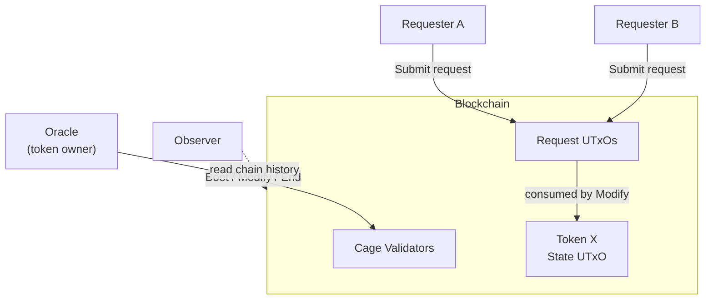
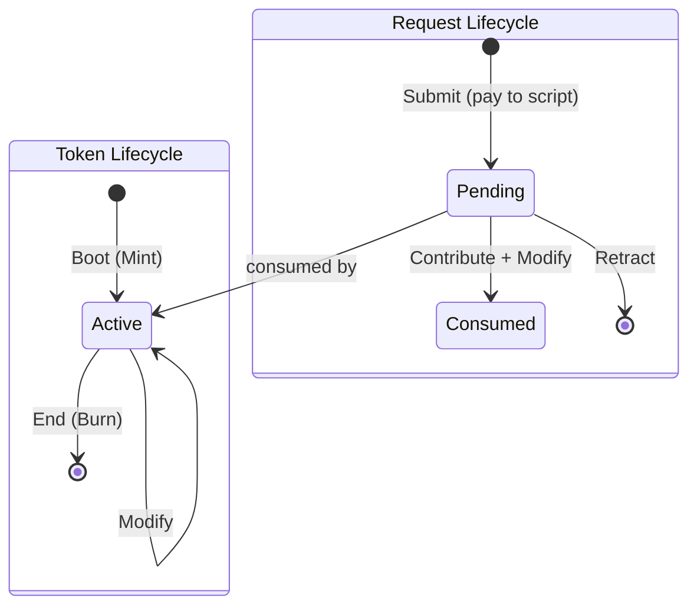
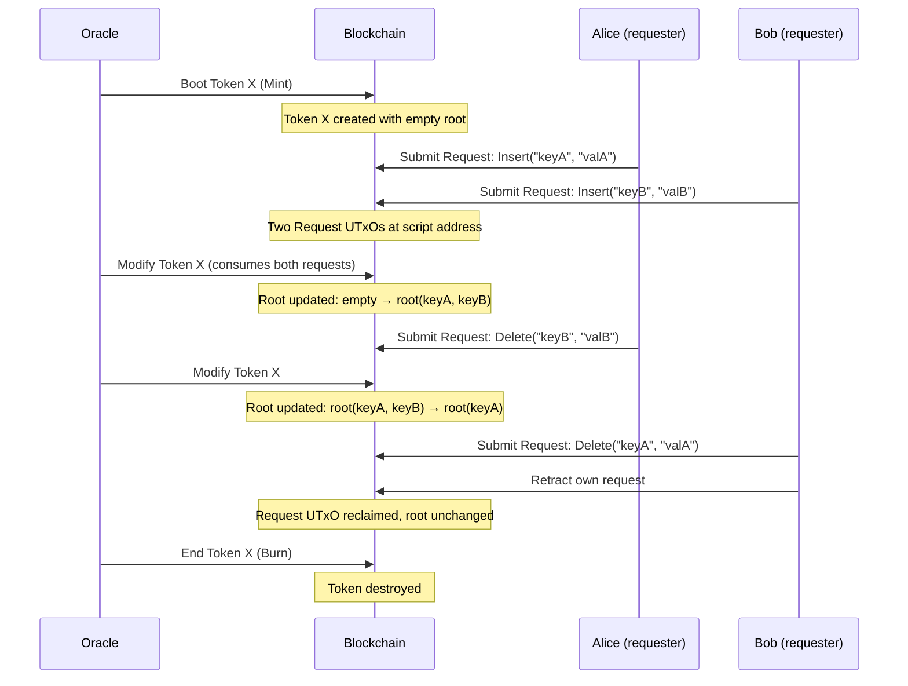

# Architecture Overview

## System Context

The on-chain validators are one half of the
[MPFS system](https://github.com/cardano-foundation/mpfs)
([documentation](https://cardano-foundation.github.io/mpfs/)).
They enforce the rules for creating, updating, and destroying MPF
token instances on the Cardano blockchain. The off-chain service
that builds transactions and manages the trie lives in the
[`off_chain/`](https://github.com/cardano-foundation/mpfs/tree/main/off_chain)
directory of the upstream repository.

The **oracle** (token owner) controls the MPF token: it boots
the token, applies pending requests via `Modify`, and can
destroy it with `End`. **Requesters** submit modification
requests as UTxOs at the script address. **Observers** read
the MPF state from the blockchain history — no on-chain
interaction is needed.

## Transaction Lifecycle

The token and requests have separate lifecycles that intersect
when the oracle processes a `Modify` transaction.

| Transaction | Action | Validator |
|---|---|---|
| Boot | Mint a new MPF token with empty root | Minting policy |
| Submit | Lock ADA at script with a modification request | — (pay to script, no validator) |
| Modify | Oracle applies pending requests, updates MPF root | Spending validator (Modify on state + Contribute on each request) |
| Retract | Request owner cancels a pending request, reclaims ADA | Spending validator (Retract) |
| End | Burn the MPF token, destroy the instance | Minting policy (Burning) + Spending validator (End) |

## Protocol Flow

## Security Properties

The validators enforce 17 invariants across 12 categories, each
verified by the inline test suite (44 tests / 242 checks):

1. **Ownership** — only the oracle (token owner) can modify or destroy a token.
2. **Integrity** — every MPF modification carries a cryptographic proof
   verified on-chain; the output root must match the proof computation.
3. **Uniqueness** — token IDs are derived from spent UTxOs, guaranteed
   unique by the ledger.
4. **Confinement** — the token must remain at the script address after
   every operation.
5. **Retractability** — request owners can always reclaim their locked ADA.
6. **Request binding** — a request's target token is validated on-chain
   before it can be consumed.
7. **Type safety** — each redeemer/datum combination is enforced; mismatches
   are rejected.

See [Security Properties](properties.md) for the complete list with
test cross-references.

## Aiken Dependencies

| Dependency | Version | Purpose |
|---|---|---|
| [aiken-lang/stdlib](https://github.com/aiken-lang/stdlib) | v2.2.0 | Standard library (assets, transactions, addresses) |
| [aiken-lang/merkle-patricia-forestry](https://github.com/aiken-lang/merkle-patricia-forestry) | v2.0.0 | MPF trie operations and proof verification |
| [aiken-lang/fuzz](https://github.com/aiken-lang/fuzz) | v2.1.1 | Property-based testing (used in test suite only) |
