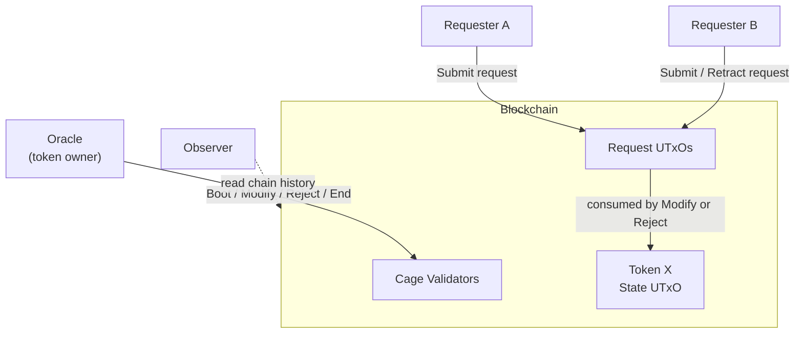
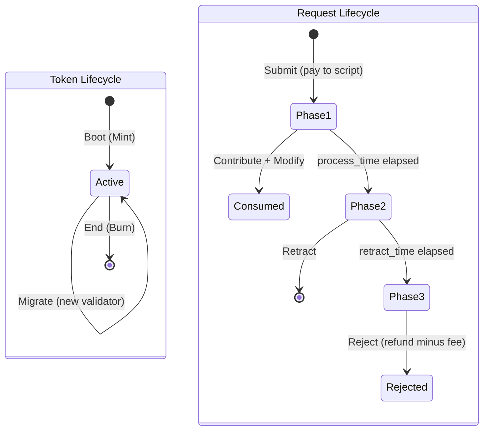

# Architecture Overview

## System Context

The on-chain validators are one half of the
[MPFS system](https://github.com/cardano-foundation/mpfs)
([documentation](https://cardano-foundation.github.io/mpfs/)).
They enforce the rules for creating, updating, and destroying MPF
token instances on the Cardano blockchain. The off-chain service
that builds transactions and manages the trie lives in the
[`off_chain/`](https://github.com/cardano-foundation/mpfs/tree/main/off_chain)
directory of the upstream repository.

The **oracle** (token owner) controls the MPF token: it boots
the token, applies pending requests via `Modify`, rejects
expired or dishonest requests via `Reject`, and can destroy
it with `End`. **Requesters** submit modification requests as
UTxOs at the script address and can retract them during Phase 2.
**Observers** read the MPF state from the blockchain history —
no on-chain interaction is needed.

## Transaction Lifecycle

The token and requests have separate lifecycles that intersect
when the oracle processes a `Modify` transaction.

### Time-Gated Phases

Each request passes through three exclusive time phases,
enforced on-chain via `tx.validity_range`. The phase boundaries
are determined by the request's `submitted_at` timestamp and the
validator's immutable `process_time` and `retract_time` parameters.

```mermaid
gantt
    title Request Time Phases
    dateFormat X
    axisFormat %s

    section Phases
    Phase 1 - Oracle Modify   :active, p1, 0, 10
    Phase 2 - Requester Retract :crit, p2, 10, 20
    Phase 3 - Oracle Reject    :done, p3, 20, 30
```

| Phase | Window | Allowed Operations | Actor |
|---|---|---|---|
| Phase 1 | `[submitted_at, submitted_at + process_time)` | Modify, Contribute | Oracle |
| Phase 2 | `[submitted_at + process_time, submitted_at + process_time + retract_time)` | Retract | Requester |
| Phase 3 | `[submitted_at + process_time + retract_time, ...)` | Reject | Oracle |

A request with a **dishonest `submitted_at`** (in the future) is
immediately rejectable by the oracle, regardless of phase.

| Transaction | Action | Validator | Phase |
|---|---|---|---|
| Boot | Mint a new MPF token with empty root | Minting policy | — |
| Submit | Lock ADA at script with a modification request | — (pay to script, no validator) | — |
| Modify | Oracle applies pending requests, updates MPF root | Spending validator (Modify on state + Contribute on each request) | 1 |
| Retract | Request owner cancels a pending request, reclaims ADA | Spending validator (Retract) | 2 |
| Reject | Oracle discards expired/dishonest requests, refunds ADA minus fee | Spending validator (Reject on state + Contribute on each request) | 3 |
| Migrate | Move token to a new validator version | Minting policy (Burning old + Migrating new) + Spending validator (End) | — |
| End | Burn the MPF token, destroy the instance | Minting policy (Burning) + Spending validator (End) | — |

## Protocol Flow

```mermaid
sequenceDiagram
    participant O as Oracle
    participant B as Blockchain
    participant A as Alice (requester)
    participant C as Bob (requester)

    O->>B: Boot Token X (Mint)
    Note over B: Token X created with empty root

    A->>B: Submit Request: Insert("keyA", "valA")
    C->>B: Submit Request: Insert("keyB", "valB")
    Note over B: Two Request UTxOs at script address

    rect rgb(40, 80, 40)
        Note over O,B: Phase 1 — Oracle processes requests
        O->>B: Modify Token X (consumes both requests)
        Note over B: Root updated: empty → root(keyA, keyB)
    end

    A->>B: Submit Request: Delete("keyB", "valB")
    rect rgb(40, 80, 40)
        Note over O,B: Phase 1
        O->>B: Modify Token X
        Note over B: Root updated: root(keyA, keyB) → root(keyA)
    end

    C->>B: Submit Request: Delete("keyA", "valA")
    rect rgb(80, 80, 40)
        Note over C,B: Phase 2 — Requester retracts
        C->>B: Retract own request
        Note over B: Request UTxO reclaimed, root unchanged
    end

    A->>B: Submit Request: Insert("spam", "data")
    rect rgb(80, 40, 40)
        Note over O,B: Phase 3 — Oracle rejects expired request
        O->>B: Reject (refund ADA minus fee, root unchanged)
    end

    O->>B: End Token X (Burn)
    Note over B: Token destroyed
```

## Security Properties

The validators enforce invariants across 16 categories, each
verified by the inline test suite (67 tests):

1. **Ownership** — only the oracle (token owner) can modify, reject, or destroy a token.
2. **Integrity** — every MPF modification carries a cryptographic proof
   verified on-chain; the output root must match the proof computation.
3. **Uniqueness** — token IDs are derived from spent UTxOs, guaranteed
   unique by the ledger.
4. **Confinement** — the token must remain at the script address after
   every operation.
5. **Retractability** — request owners can reclaim their locked ADA during Phase 2.
6. **Request binding** — a request's target token is validated on-chain
   before it can be consumed.
7. **Type safety** — each redeemer/datum combination is enforced; mismatches
   are rejected.
8. **Time-gated phases** — each request passes through three exclusive phases
   (oracle Modify, requester Retract, oracle Reject), preventing race conditions.
9. **DDoS protection** — expired or dishonest requests can be rejected by the
   oracle, who keeps the fee and refunds the rest.
10. **Fee enforcement** — oracle fees are validated on-chain; requesters are
    refunded correctly.

See [Security Properties](properties.md) for the complete list with
test cross-references.

## Aiken Dependencies

| Dependency | Version | Purpose |
|---|---|---|
| [aiken-lang/stdlib](https://github.com/aiken-lang/stdlib) | v2.2.0 | Standard library (assets, transactions, addresses) |
| [aiken-lang/merkle-patricia-forestry](https://github.com/aiken-lang/merkle-patricia-forestry) | v2.0.0 | MPF trie operations and proof verification |
| [aiken-lang/fuzz](https://github.com/aiken-lang/fuzz) | v2.1.1 | Property-based testing (used in test suite only) |
