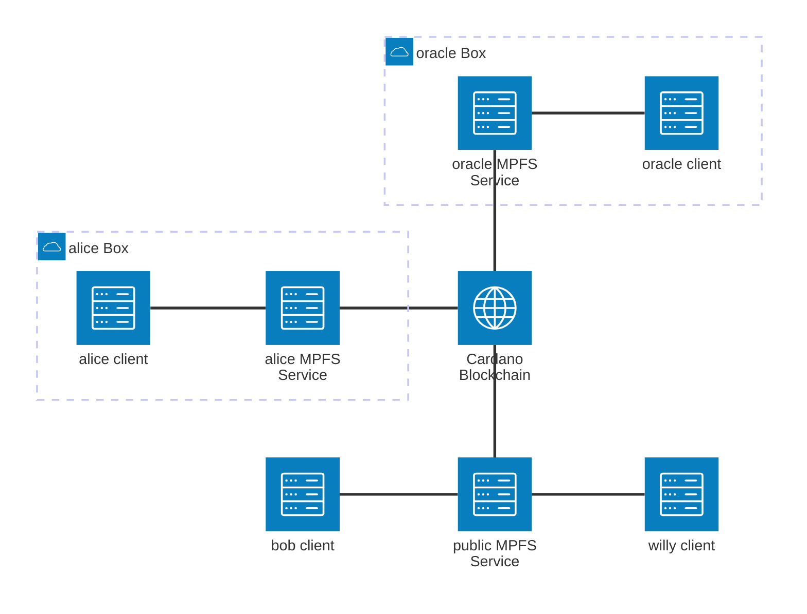
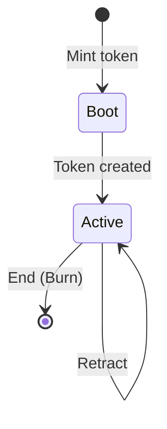
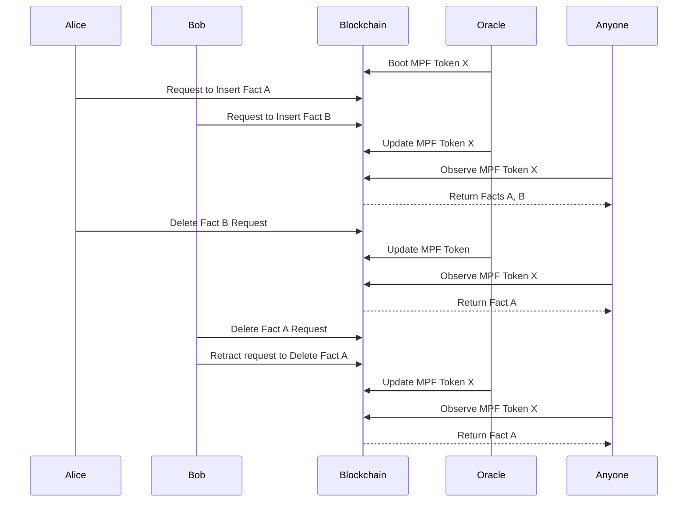

# Architecture Overview

## System Context

The on-chain validators are one half of the MPFS system. They
enforce the rules for creating, updating, and destroying MPF
token instances on the Cardano blockchain.



Each MPFS service instance talks to the blockchain through the
on-chain validators. Multiple independent services can coexist,
each managing its own set of MPF tokens.

## Transaction Lifecycle

Five transaction types interact with the validators:



| Transaction | Action | Validator |
|---|---|---|
| Boot | Mint a new MPF token with empty root | Minting policy |
| Request | Lock ADA at script with a modification request | — (pay to script) |
| Update | Apply pending requests, update MPF root | Spending validator (Modify + Contribute) |
| Retract | Cancel a pending request, reclaim ADA | Spending validator (Retract) |
| End | Burn the MPF token, destroy the instance | Minting policy + Spending validator (End) |

## Protocol Flow



## Security Properties

The validators enforce 17 invariants across 12 categories, each
verified by the inline test suite (44 tests / 242 checks):

1. **Ownership** — only the oracle (token owner) can modify or destroy a token.
2. **Integrity** — every MPF modification carries a cryptographic proof
   verified on-chain; the output root must match the proof computation.
3. **Uniqueness** — token IDs are derived from spent UTxOs, guaranteed
   unique by the ledger.
4. **Confinement** — the token must remain at the script address after
   every operation.
5. **Retractability** — request owners can always reclaim their locked ADA.
6. **Type safety** — each redeemer/datum combination is enforced; mismatches
   are rejected.
7. **Verifiability** — all changes are traceable via blockchain history.

See [Security Properties](properties.md) for the complete list with
test cross-references.

## Aiken Dependencies

```toml
name = "hal/mpf"
version = "0.0.0"
compiler = "v1.1.16"
plutus = "v3"

[[dependencies]]
name = "aiken-lang/stdlib"
version = "v2.2.0"

[[dependencies]]
name = "aiken-lang/merkle-patricia-forestry"
version = "v2.0.0"
```
