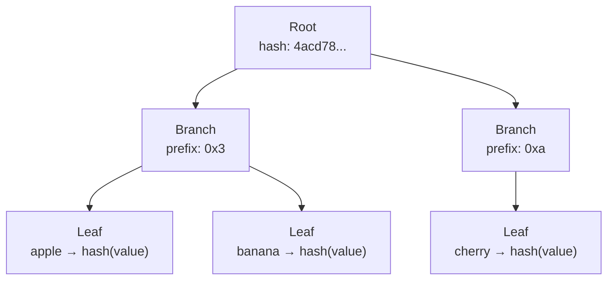
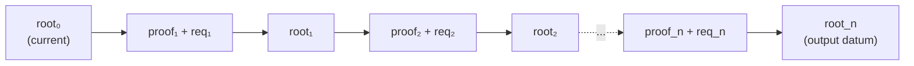

# Proof System

The on-chain validators verify Merkle Patricia Forestry (MPF)
proofs to ensure that every trie modification is cryptographically
valid.

## MPF Structure

MPF is a radix-16 (hexadecimal) trie. Each node has up to 16
children (one per hex digit). Paths are compressed: consecutive
nodes with a single child are collapsed into a single edge with
a skip value.



## Core Type

```aiken
type MerklePatriciaForestry  -- opaque, wraps a 32-byte root hash
```

Constructed via:

- `from_root(root: ByteArray)` — wrap an existing root hash
- `empty` — the empty trie (well-known null hash)

## Proof Format

A proof is a path from the root to the target element:

```aiken
type Proof = List<ProofStep>

type ProofStep {
    Branch { skip: Int, neighbors: ByteArray }
    Fork { skip: Int, neighbor: Neighbor }
    Leaf { skip: Int, key: ByteArray, value: ByteArray }
}

type Neighbor {
    nibble: Int
    prefix: ByteArray
    root: ByteArray
}
```

| Step | Description |
|---|---|
| `Branch` | A node with multiple children. `skip` is the common prefix length. `neighbors` is a packed byte array of sibling hashes (sparse 16-element array) |
| `Fork` | A node where the path diverges. `neighbor` describes the other branch |
| `Leaf` | A terminal node. `key` is the remaining suffix, `value` is the stored value |

## Proof Verification

The MPF library provides two core verification functions:

```aiken
fn including(key, value, proof) -> ByteArray
```

Computes what the root hash **would be** if `(key, value)` is
present. Used to verify inclusion and to compute the new root
after insertion.

```aiken
fn excluding(key, proof) -> ByteArray
```

Computes what the root hash **would be** if `key` is absent.
Used to verify exclusion and to compute the new root after
deletion.

## On-Chain Operations

The spending validator uses proofs for each operation:

### Insert

Proves the key is **absent**, then computes the new root with
the key present.

```
old_root == excluding(key, proof)
new_root  = including(key, new_value, proof)
```

### Delete

Proves the key is **present** with the expected value, then
computes the new root with the key absent.

```
old_root == including(key, old_value, proof)
new_root  = excluding(key, proof)
```

### Update

Proves the key is **present** with the old value, then computes
the new root with the new value.

```
old_root == including(key, old_value, proof)
new_root  = including(key, new_value, proof)
```

## Proof Folding

When multiple requests are processed in a single `Modify`
transaction, proofs are folded left-to-right:



Each proof is relative to the intermediate root produced by the
previous step. The final root must match the output datum.

## Hashing

MPF uses **Blake2b-256** (Aiken-compatible):

**Leaf hash:**

```
digest(hashHead || hashTail || valueDigest)
```

- Even-length suffix: `hashHead = 0xff`, `hashTail = all digits`
- Odd-length suffix: `hashHead = 0x00 || first digit`, `hashTail = remaining`

**Branch hash:**

```
digest(nibbleBytes(prefix) || merkleRoot)
```

**Merkle root:** pairwise reduction of a sparse 16-element array
of child hashes.

## Performance

Average proof sizes and execution costs by trie size:

| Elements | Proof Size | Memory | CPU |
|---|---|---|---|
| 10² | ~250 bytes | ~70K | ~28M |
| 10³ | ~350 bytes | ~100K | ~42M |
| 10⁴ | ~460 bytes | ~130K | ~56M |
| 10⁶ | ~670 bytes | ~190K | ~84M |

Proof size grows logarithmically with the number of elements,
making MPF practical even for very large datasets.
