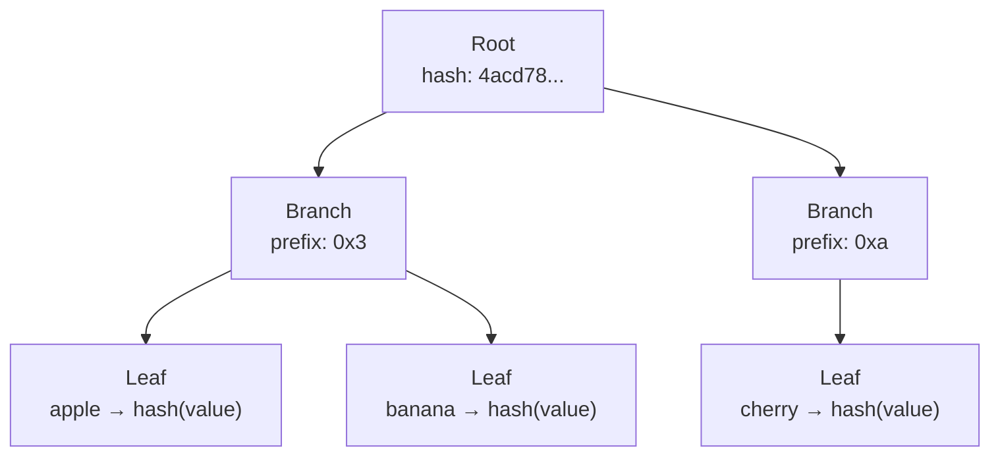
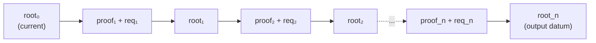

# Proof System

The on-chain validators verify
[Merkle Patricia Forestry](https://github.com/aiken-lang/merkle-patricia-forestry)
(MPF) proofs to ensure that every trie modification is
cryptographically valid.

## MPF Structure

MPF is a radix-16 (hexadecimal) trie. Each node has up to 16
children (one per hex digit). Paths are compressed: consecutive
nodes with a single child are collapsed into a single edge with
a skip value.



## Core Type

```aiken
type MerklePatriciaForestry  -- opaque, wraps a 32-byte root hash
```

Constructed via:

- `from_root(root: ByteArray)` — wrap an existing root hash
- `empty` — the empty trie (well-known null hash)

## Proof Format

A proof is a path from the root to the target element:

```aiken
type Proof = List<ProofStep>

type ProofStep {
    Branch { skip: Int, neighbors: ByteArray }
    Fork { skip: Int, neighbor: Neighbor }
    Leaf { skip: Int, key: ByteArray, value: ByteArray }
}

type Neighbor {
    nibble: Int
    prefix: ByteArray
    root: ByteArray
}
```

| Step | Description |
|---|---|
| `Branch` | A node with multiple children. `skip` is the common prefix length. `neighbors` is a packed byte array of sibling hashes (sparse 16-element array) |
| `Fork` | A node where the path diverges. `neighbor` describes the other branch |
| `Leaf` | A terminal node. `key` is the remaining suffix, `value` is the stored value |

## Public API

The MPF library exposes three mutation functions used by the
spending validator:

```aiken
fn insert(self, key, value, proof) -> MerklePatriciaForestry
fn delete(self, key, value, proof) -> MerklePatriciaForestry
fn update(self, key, proof, old_value, new_value) -> MerklePatriciaForestry
```

Each takes the current `MerklePatriciaForestry` (root), verifies
the proof against it, and returns a new root. If the proof is
invalid the function fails, aborting the transaction.

Internally the library uses two helper functions (`including` and
`excluding`) that compute what the root hash **would be** if a
key-value pair is present or absent. These are not exported but
underpin the public API.

## On-Chain Operations

The spending validator calls the MPF functions for each request
operation:

### Insert

Verifies the key is **absent** (via `excluding`), then computes
the new root with the key present (via `including`).

```aiken
new_root = mpf.insert(old_root, key, new_value, proof)
```

### Delete

Verifies the key is **present** with the expected value (via
`including`), then computes the new root with the key absent
(via `excluding`).

```aiken
new_root = mpf.delete(old_root, key, old_value, proof)
```

### Update

Verifies the key is **present** with the old value, then
computes the new root with the new value. Equivalent to a
delete + insert but with one fewer membership check.

```aiken
new_root = mpf.update(old_root, key, proof, old_value, new_value)
```

## Proof Folding

When multiple requests are processed in a single `Modify`
transaction, proofs are folded left-to-right:



Each proof is relative to the intermediate root produced by the
previous step. The final root must match the output datum.

## Hashing

MPF uses **Blake2b-256** internally for all digests (key hashing,
value hashing, node hashing). See the
[library source](https://github.com/aiken-lang/merkle-patricia-forestry)
for implementation details.

Proof size grows logarithmically with the number of elements in
the trie, making MPF practical even for very large datasets.
