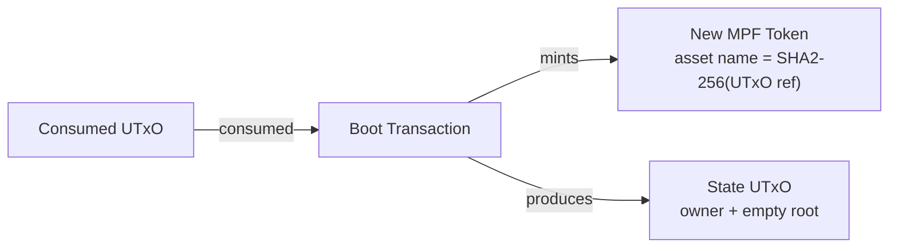
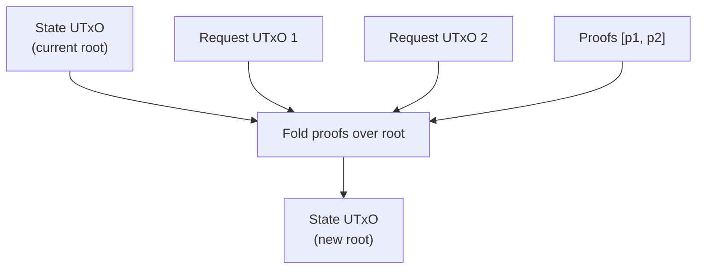

# Validators

The on-chain logic lives in a single script (`cage.ak`) that
implements both a **minting policy** and a **spending validator**.

## Minting Policy (`mpfCage.mint`)

Controls creation and destruction of MPF tokens.

### Boot (Minting)

Creates a new MPF token instance.

**Validation rules:**

1. Asset name is the SHA2-256 hash of a consumed UTxO reference
   (ensures global uniqueness).
2. Exactly one token is minted.
3. The token is sent to the script address.
4. The output datum is a `StateDatum` with an empty MPF root
   (`root(empty)`).
5. The owner is set to the transaction signer.

### Burning

Burns the MPF token when the instance is destroyed. No additional
validation beyond the spending validator's `End` redeemer.

---

## Spending Validator (`mpfCage.spend`)

Handles four operations on UTxOs locked at the script address.

### Modify (ConStr2)

The token owner applies pending requests to the MPF trie.

**Redeemer:** `Modify(List<Proof>)` — one proof per consumed request.

**Validation rules:**

- Owner must sign the transaction.
- All consumed request UTxOs reference the correct token.
- Each request is paired with a valid MPF proof.
- The proofs are folded left-to-right over the current root to
  compute the new root.
- The output datum's root must equal the computed new root.
- The token remains at the script address.

**Proof folding:** For each request, the validator calls the
appropriate MPF function based on the operation type:

| Operation | MPF Function | Proof Shows |
|---|---|---|
| Insert(value) | `insert(key, value, proof)` | Key is absent |
| Delete(value) | `delete(key, value, proof)` | Key is present with value |
| Update(old, new) | `update(key, proof, old, new)` | Key is present with old value |

### Contribute (ConStr1)

Spends a request UTxO during an update. Used together with
`Modify` in the same transaction — the state UTxO uses `Modify`,
while each request UTxO uses `Contribute`.

**Redeemer:** `Contribute(OutputReference)` — points to the
state UTxO being updated.

**Validation rules:**

- The referenced state UTxO is consumed in the same transaction.
- The request's `requestToken` matches the state's token.

### Retract (ConStr3)

Allows a request owner to cancel a pending request and reclaim
their locked ADA.

**Validation rules:**

- The request owner must sign the transaction.

### End (ConStr0)

Destroys the MPF token instance.

**Validation rules:**

- The token owner must sign the transaction.
- The token is burned (mint field contains -1 of the token).

---

## Helper Functions (`lib.ak`)

| Function | Signature | Purpose |
|---|---|---|
| `quantity` | `TokenId -> Value -> Int` | Get token quantity in a value |
| `assetName` | `OutputReference -> AssetName` | Compute unique asset name via SHA2-256 |
| `valueFromToken` | `TokenId -> Value` | Construct value with exactly 1 token |
| `tokenFromValue` | `Value -> TokenId` | Extract single non-ADA token from value |
| `extractTokenFromInputs` | `List<Input> -> TokenId -> (Input, List<Input>)` | Find and extract the input carrying a token |
