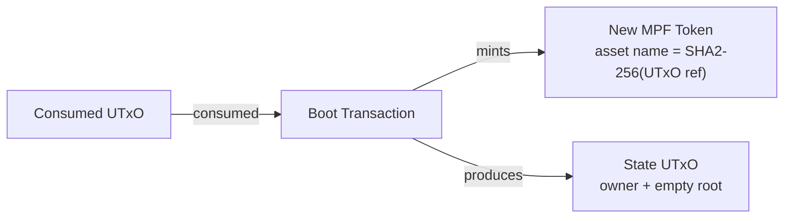
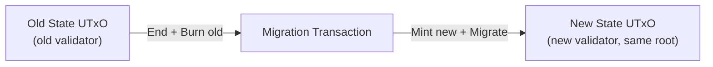
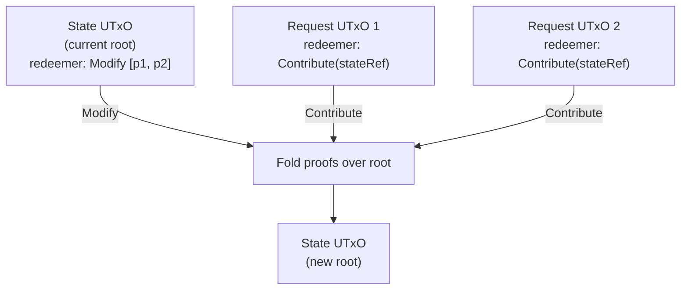
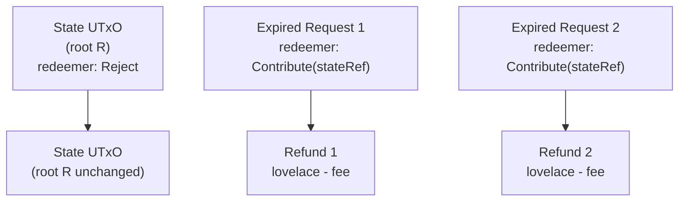

# Validators

The on-chain logic lives in a single script
([`cage.ak`](https://github.com/cardano-foundation/cardano-mpfs-onchain/blob/main/validators/cage.ak))
that implements both a **minting policy** and a **spending validator**.
Helper functions are in
[`lib.ak`](https://github.com/cardano-foundation/cardano-mpfs-onchain/blob/main/validators/lib.ak).

## Validator Parameters

The cage validator is parameterized by three immutable values,
set at deployment time:

```aiken
validator mpfCage(_version: Int, process_time: Int, retract_time: Int) {
```

| Parameter | Type | Description |
|---|---|---|
| `_version` | `Int` | Version tag (enables migration between validator versions) |
| `process_time` | `Int` | Duration (ms) of Phase 1 — oracle-exclusive processing window |
| `retract_time` | `Int` | Duration (ms) of Phase 2 — requester-exclusive retract window |

Different parameter values produce different script hashes and
addresses. The parameters are baked into the compiled script, so
they cannot be changed after deployment.

---

## Minting Policy (`mpfCage.mint`)

Controls creation, migration, and destruction of MPF tokens.

### Boot (Minting)

Creates a new MPF token instance.

**Validation rules:**

1. Asset name is the SHA2-256 hash of a consumed UTxO reference
   (ensures global uniqueness).
2. Exactly one token is minted.
3. The token is sent to the script address.
4. The output datum is a `StateDatum` with an empty MPF root
   (`root(empty)`).
5. The owner field is unrestricted (any `VerificationKeyHash`).



### Migration (Migrating)

Mints a token under the new validator by carrying over the identity
and root from an old validator version.

**Validation rules:**

1. The old token (under `oldPolicy`) is burned (-1) in the same
   transaction.
2. Exactly one new token is minted.
3. The token is sent to the new validator's script address.
4. The output carries a `StateDatum` (root may be non-empty).



### Burning

Burns the MPF token when the instance is destroyed. No additional
validation beyond the spending validator's `End` redeemer.

---

## Spending Validator (`mpfCage.spend`)

Handles five operations on UTxOs locked at the script address.

### Modify (ConStr2)

The token owner applies pending requests to the MPF trie.
Only allowed during **Phase 1** of each request.

**Redeemer:** `Modify(List<Proof>)` — one proof per consumed request.

**Validation rules:**

- Owner must sign the transaction.
- The transaction validity range must be entirely within Phase 1
  for every consumed request (`tx valid before submitted_at + process_time`).
- Each request's `fee` must equal `state.max_fee`.
- All consumed request UTxOs reference the correct token.
- Each request is paired with a valid MPF proof.
- The proofs are folded left-to-right over the current root to
  compute the new root.
- The output datum's root must equal the computed new root.
- The token remains at the script address.
- Each requester receives a refund of `lovelace - fee`.



**Proof folding:** For each request, the validator calls the
appropriate MPF function based on the operation type:

| Operation | MPF Function | Proof Shows |
|---|---|---|
| Insert(value) | `mpf.insert(root, key, value, proof)` | Key is absent |
| Delete(value) | `mpf.delete(root, key, value, proof)` | Key is present with value |
| Update(old, new) | `mpf.update(root, key, proof, old, new)` | Key is present with old value |

### Contribute (ConStr1)

Spends a request UTxO during an update or reject. Used together
with `Modify` or `Reject` in the same transaction — the state
UTxO uses `Modify`/`Reject`, while each request UTxO uses
`Contribute`.

**Redeemer:** `Contribute(OutputReference)` — points to the
state UTxO being updated.

**Validation rules:**

- The referenced state UTxO is consumed in the same transaction.
- The request's `requestToken` matches the state's token.
- The request must be in **Phase 1** (for Modify) or **rejectable**
  (Phase 3 or dishonest `submitted_at`). Phase 2 is blocked to
  protect the requester's exclusive retract window.

### Retract (ConStr3)

Allows a request owner to cancel a pending request and reclaim
their locked ADA. Only allowed during **Phase 2**.

**Validation rules:**

- The request owner must sign the transaction.
- The transaction validity range must be entirely within Phase 2
  (`tx valid after submitted_at + process_time - 1` and
  `tx valid before submitted_at + process_time + retract_time`).

### Reject (ConStr4)

Allows the oracle to discard expired or dishonest requests.
The oracle keeps the fee and refunds the remaining lovelace
to each requester. The MPF root must **not** change.

**Redeemer:** `Reject` — applied to the state UTxO. Each request
UTxO uses `Contribute`.

**Validation rules:**

- Owner must sign the transaction.
- Each request must be **rejectable**: either in Phase 3
  (`tx valid after submitted_at + process_time + retract_time - 1`)
  or have a dishonest `submitted_at` (in the future).
- The output root must equal the input root (no MPF changes).
- The token remains at the script address.
- Each requester receives a refund of `lovelace - fee`.



### End (ConStr0)

Destroys the MPF token instance.

**Validation rules:**

- The token owner must sign the transaction.
- The token is burned (mint field contains -1 of the token).

---

## Helper Functions (`lib.ak`)

| Function | Signature | Purpose |
|---|---|---|
| `quantity` | `(PolicyId, Value, TokenId) -> Option<Int>` | Get token quantity in a value |
| `assetName` | `OutputReference -> AssetName` | Compute unique asset name via SHA2-256 |
| `valueFromToken` | `(PolicyId, TokenId) -> Value` | Construct value with exactly 1 token |
| `tokenFromValue` | `Value -> Option<TokenId>` | Extract single non-ADA token from value |
| `extractTokenFromInputs` | `(OutputReference, List<Input>) -> Option<(Input, TokenId)>` | Find input by ref and extract its token |
